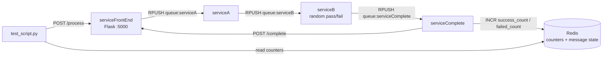

# Microservices Pipeline Demo

**A four-service message pipeline on Redis work queues, runnable with Docker Compose or Kubernetes.**

A Flask front end accepts a message over HTTP and pushes it onto a Redis list. Three Python workers pull it through in sequence, each one appending its name, and the last worker calls back to the front end and bumps success or failure counters in Redis. A test script sends a batch and prints the tally.

## What it does

- **HTTP in, queue out.** `POST /process` on the front end assigns a UUID, appends `_serviceFrontEnd` to the message, and pushes it onto `queue:serviceA`. It returns the id right away and does not wait for the pipeline.
- **Work queues, not pub/sub.** Every worker blocks on `BLPOP` against its own Redis list and `RPUSH`es to the next. A message is handed to exactly one consumer, so replicas can be added without duplicate processing.
- **A simulated failure step.** serviceB flips a coin. Half of messages get `_serviceB_SUCCESS`, the other half get `_FAILED`. Both continue to serviceComplete.
- **Idempotent counters.** serviceComplete uses `HSETNX` on a per-message `counted` flag before incrementing `success_count` or `failed_count`, so a redelivered message is only counted once.
- **Completion callback.** serviceComplete posts the final message to `POST /complete` on the front end, which records the terminal state.
- **Per-message state in Redis.** Each service writes its progress to a `message:<id>` hash, so you can inspect where any message got to.
- **Structured logs.** Every service logs one JSON line per event to stdout and to a local `.log` file.
- **Kubernetes manifests.** Namespace, Redis with a ConfigMap, a logs PVC, one Deployment per service with resource limits and probes, an HPA on serviceB, and an nginx Ingress.

## How it works



A message that starts as `TestMessage` ends as `TestMessage_serviceFrontEnd_serviceA_serviceB_SUCCESS` or `TestMessage_serviceFrontEnd_serviceA_FAILED`.

## Quick start

You need Docker with Compose. Python 3.11 with `requests` and `redis` is needed for the test script.

**1. Start the stack**

```bash
docker compose up --build -d
docker compose ps
```

Redis is published on `localhost:6379` and the front end on `localhost:5001`.

**2. Send a message by hand**

```bash
curl -X POST http://localhost:5001/process \
  -H 'Content-Type: application/json' \
  -d '{"message": "hello"}'
```

**3. Run the test script**

```bash
python3.11 -m venv venv && source venv/bin/activate
pip install requests redis
python3.11 test_script.py
```

It sends two single messages, then a batch of 100, waits ten seconds, and prints total, successful, failed, and stuck counts read from Redis. Counters persist for the life of the Redis container, so totals accumulate across runs.

**4. Watch the logs**

```bash
docker compose logs -f servicea serviceb servicecomplete
```

### Kubernetes

`deploy-to-k8s.sh` builds the four images, rebuilds them inside Minikube's Docker daemon if `minikube` is on the path, applies the manifests in order, and waits for every Deployment in the `hsrn-vip` namespace.

```bash
./deploy-to-k8s.sh
```

Then test through port-forwards, which works on any cluster:

```bash
kubectl -n hsrn-vip port-forward svc/redis 6379:6379 &
kubectl -n hsrn-vip port-forward svc/servicefrontend 8080:5000 &
./k8s-test-script.py --host=localhost --port=8080 --redis-host=localhost --redis-port=6379
```

`k8s-test-script.py` takes `--host`, `--port`, `--redis-host`, `--redis-port`, and `--batch-size`. Minikube, LoadBalancer, scaling, and cleanup commands are in [k8s/README.md](k8s/README.md).

## Configuration

There are no environment variables. Redis is reached at `redis:6379` and the callback goes to `serviceFrontEnd:5000`, both hardcoded in the services. The Kubernetes manifests set `REDIS_HOST` and `REDIS_PORT` on each pod, but the code does not read them; it works because the Redis Service is also named `redis`.

## Project layout

```
├── docker-compose.yml       Redis plus the four services; front end on host port 5001
├── deploy-to-k8s.sh         Build images and apply k8s/ in order
├── test_script.py           Compose test: sends messages, prints Redis counters
├── k8s-test-script.py       Same test with host and port flags for a cluster
├── serviceFrontEnd/         Flask app: POST /process and POST /complete
├── serviceA/                Worker: appends _serviceA
├── serviceB/                Worker: appends _serviceB_SUCCESS or _FAILED at random
├── serviceComplete/         Worker: counts the result and calls back to the front end
└── k8s/                     Namespace, Redis ConfigMap, logs PVC, Deployments, HPA, Ingress
```

Each service directory holds one Python file and a Dockerfile based on `python:3.11-slim` that installs its dependencies with `pip` directly. There are no requirements files.

## Limitations

- The pipeline has no retries or dead-letter queue. If a worker crashes after `BLPOP` and before `RPUSH`, that message is lost and shows up as "stuck" in the test output.
- The front end has no `GET /` route, but the Kubernetes liveness and readiness probes for `servicefrontend` request `/`. Expect those probes to fail unless you change the path or add the route.
- The worker liveness probes use `exec` with shell pipes (`ps aux | grep ...`), which `exec` does not interpret. They will not behave as written.
- Services log to files next to their code, not to `/app/logs`, so the logs PVC mounted in Kubernetes stays empty.
- Redis runs with no persistence. Counters and message state disappear when the container or pod restarts.
- serviceB's success rate is a fixed 50/50 and is not configurable.
- `get-pip.py` in the repo root is a stray bootstrap file and is not used by anything.
